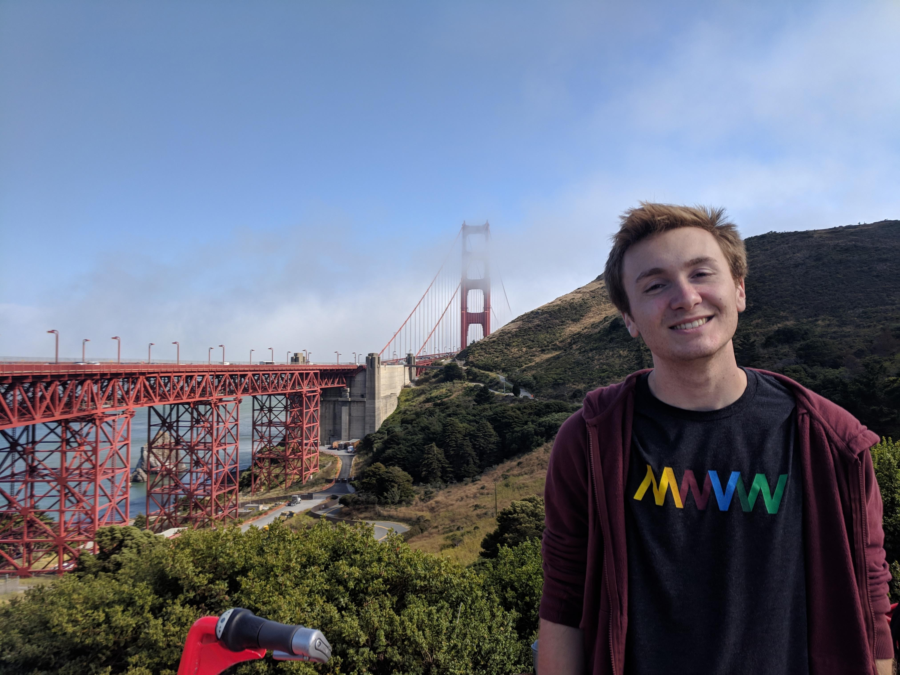

Hey! My name's <b>Connor</b> and I'm a <b>Software Engineer</b> located in the <b>Greater Boston Area</b>.

I've always been a very nerdy person. I spent most of my childhood playing and absolutely loving games like <i>Halo</i>, <i>World of Warcraft</i>, and <i>Starcraft 2</i>. I like to think amazing video games like these got me interested in technology in the first place.

When it came time to pick a major for college, I didn't really have an idea of what Computer Science actually was because my high school
didn't offer any kind of 'Intro to Computer Science' class. I did fiddle with learning some kind of programming on my own outside of school, but never managed to feel competent. Though, being intrigued by it all my life, decided to bite the bullet and try it out.

4 years later I'm a Full-Time Software Engineer!
